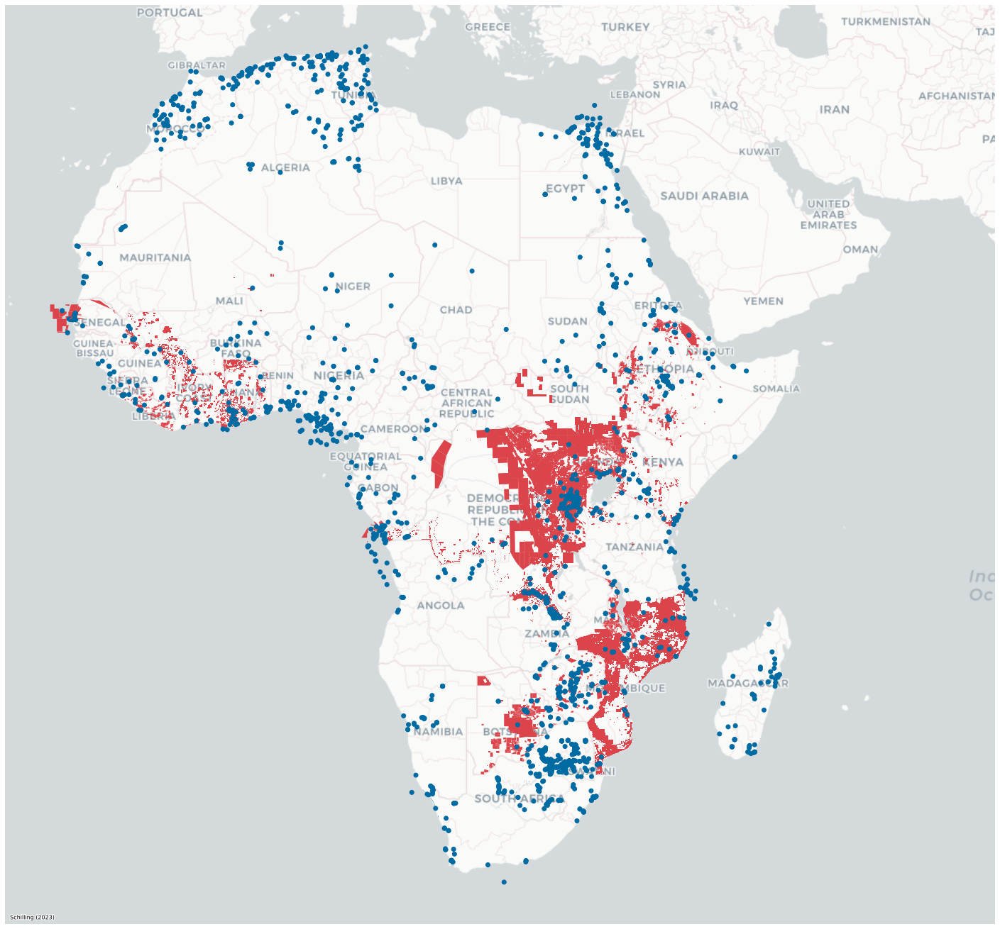



# Mining licenses in Africa

Natural resource extraction, particularly mining, holds paramount economic and political significance as it fuels economic expansion, facilitates employment opportunities, generates substantial revenue  in many low income countries. At the same time are these resources curicual to the global supply chain of electronic devices.

Natural resource extraction, particularly mining, holds immense economic and political significance as it serves as a catalyst for economic growth, fosters job opportunities, generates substantial revenue, and ensures resource stability, particularly in low-income countries. However, studying mining activities and comprehending their legal status empirically presents inherent challenges due to the intricacies of the industry, variations in legal frameworks across different jurisdictions, the prevalence of informal and illicit mining practices, limited transparency in reporting, and the involvement of numerous stakeholders. Consequently, the comprehensive collection and analysis of data become arduous tasks.

In light of these challenges, in collaboration with [Alan Jones](https://www.linkedin.com/in/alanksjones/), we have curated a comprehensive data repository of mining licenses in various low-income countries. This section presents descriptive statistics pertaining to the current project stages, shedding light on the prevailing conditions in the mining sector.

 *Location major mining depostions (blue) and public aviable mining licensese (red) on the African contient.*

## Example mining activities and licenses in Sierra Leone

The following map plots mining licenses and existing measures of mining activities across Sierra Leone.

<iframe src="/files/maps/sle_production_licenses.html" height="600" width="800"> </iframe>
