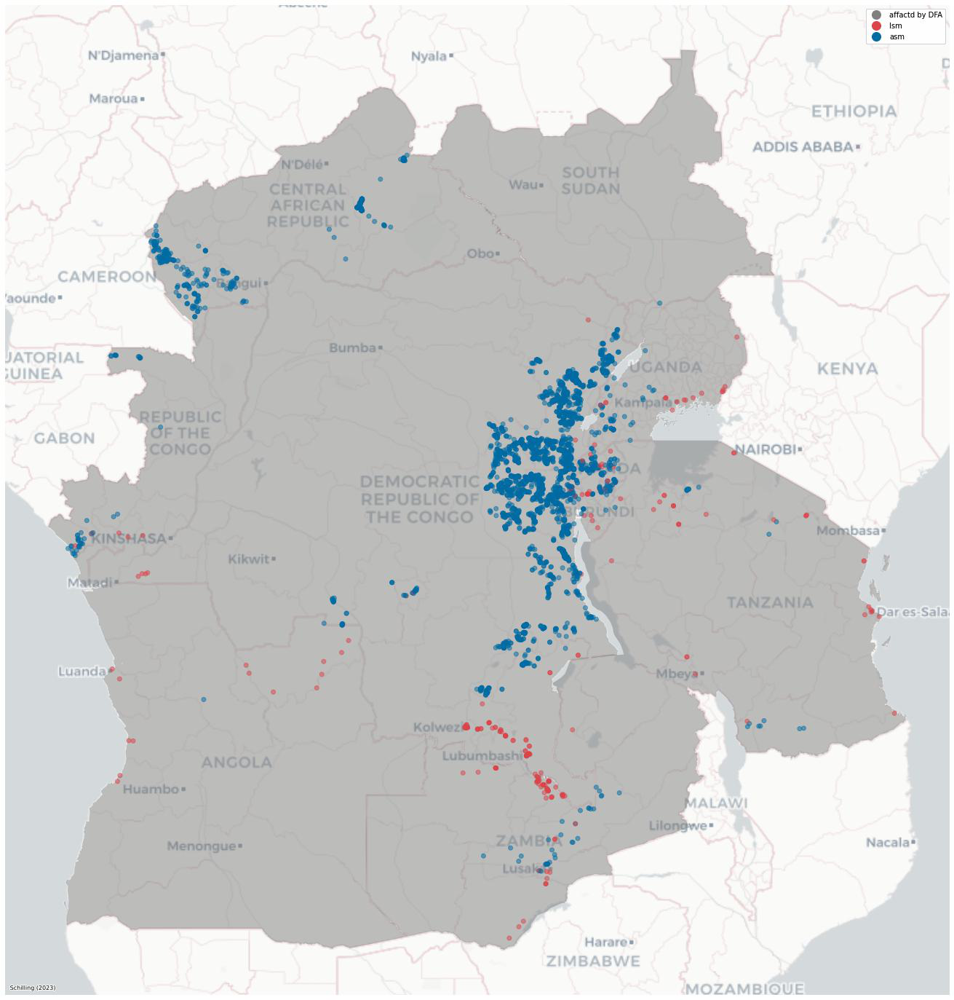
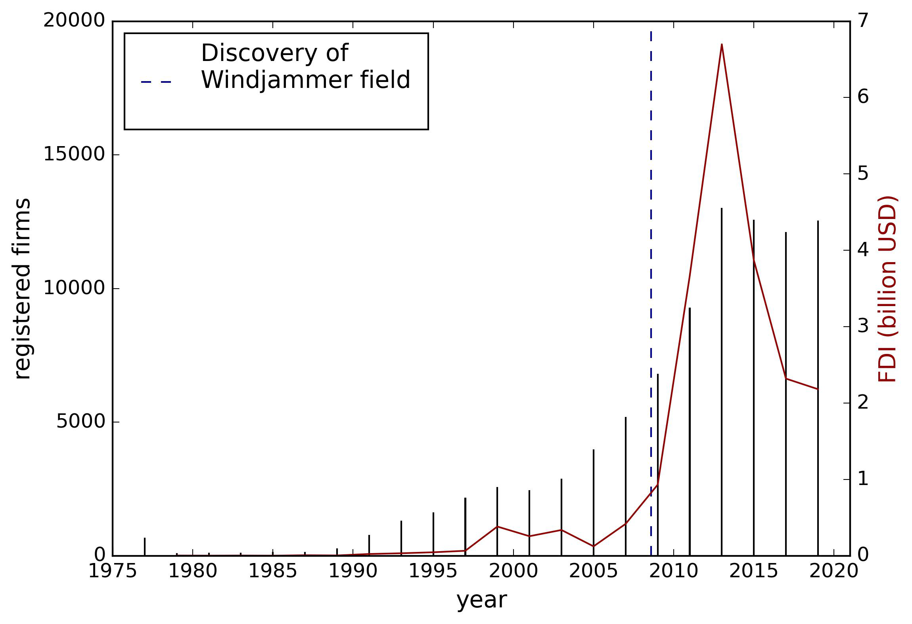
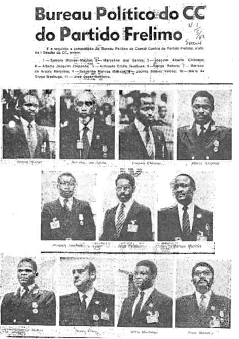
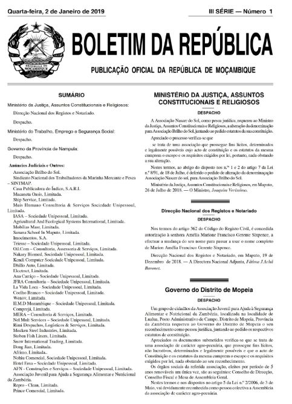



# Working paper

Please [email](mailto:fs.egb@cbs.dk) me for the latest drafts.

## Property rights under selective enforcement: How mining licenses relate to conflict in low income countries

Resource conflicts in low income countries are a major challenge, exacerbated by climate change and the increasing global demand for mining commodities. This paper examines the potential of property rights to mitigate conflict over valuable resources in the mining sector. While donors and scholars have long advocated for property rights in low income countries, little is known about how these capacity investments relate to political processes and local conflict. Using original data from administrative records in the Democratic Republic of the Congo and its neighboring countries, this paper examines how mining licenses moderate the effect of resource extraction on conflict. The main argument is that heterogeneous levels of political influence among mining stakeholders cause local conflict, and improvements in administrative capacities maintain this conflict potential if they do not address present gaps in access to rights. Empirically, the paper finds heterogenous effects on conflict levels in mining areas that get formalized through mining licenses. The paper concludes that property rights can be effective in mitigating resource conflicts, but their strength depends on rulers and bureaucracies prioritizing an efficient allocation of resources over personal access to rents.

*Location of artisanal or small-scale mining (ASM) and  large-scale mining (LSM)  sides. The dark grey areas marks the territory that is affected by the Dodd-Frank Act (DFA) section 1502 after 2010.*

## Authoritarian Political Selection: Ruling Parties and the Rise of Business Elites

with [Anne Jamison](https://www.annejamison.com/) and [Benjamin Egerod](https://bcegerod.github.io/) and [Mogens Justesen](https://sites.google.com/site/mkjustesen/)

When and why do autocrats recruit business elites to serve in government? We argue that they do so as a defense strategy when new business elites emerge. Existing work suggests that incumbent political elites attempt to block change that allows new business elites to emerge. However, authoritarian governments may respond to sudden market changes by controlling selection into firm ownership and recruitment from firm ownership into political office, in particular by installing close members of their social network as new firm owners. To test this argument, we exploit natural gas discovery in Mozambique as a natural experiment. We collect novel data on the political office-holders and match it to the full universe of business owners since the country's independence. Using a series of difference-in-differences designs we show that in the aftermath of gas discovery, owners of gas companies are much more likely to be recruited into politics. This effect is concentrated among individuals who are central in the social network of ruling political elites. The gas discovery caused a large increase in firm ownership among family members---in social proximity to ruling elites---of politicians from the ruling party. This suggests that the ruling political elite installed central members of their social network in the emerging gas industry and then used this as a springboard to recruit business owners into political office. This solves a dual commitment problem for authoritarian governments and the new business elite: the incumbent elite could commit to enacting policies that benefit the oil industry, while the new business elite could commit to being loyal to the political regime.

*Firm registrations and FDI inflow in Mozambique. Note: The left scale (bars) lists the number of annual registered firms (BRD3), the right scale (lines) list estimations of FDI inflows into Mozambique in billions of USD (World Bank)*

# Under review

## Politicians doing business: Evidence from Mozambique's firm registry

with [Sam Jones](https://esamjones.github.io/) and [Finn Tarp](https://web.econ.ku.dk/ftarp/)

We link a new database of politically exposed persons in Mozambique to the universe of owners of all private firms formally registered since Independence. Based on the network of connections between firm owners, we estimate the value of party political and executive mandates to individuals’ business interests. We find holders of political office achieve significantly faster gains, both in the number of companies owned and their structural power within the business-owner network, measured by their 'godfather centrality'. This growth is concentrated in joint-stock firms active in business services and finance sectors, and is even larger once we aggregate to the family-name level. This is consistent with politicians accumulating private sector wealth by acting as rentier-brokers.

*FRELIMO Polit Bureau 1983 (source: Colin Darch)**Cover of the BD3*
